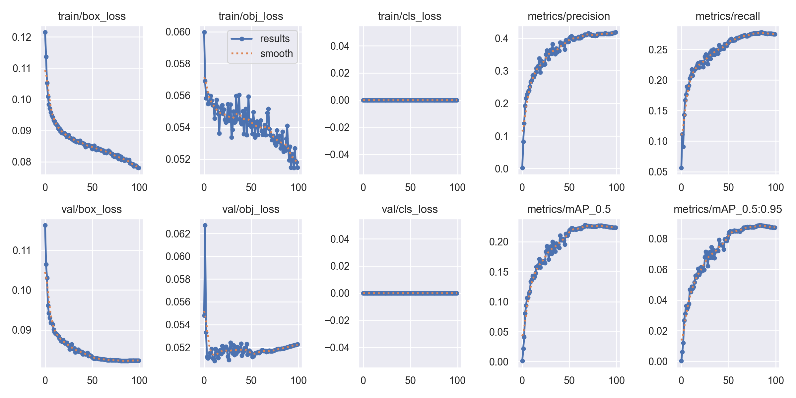
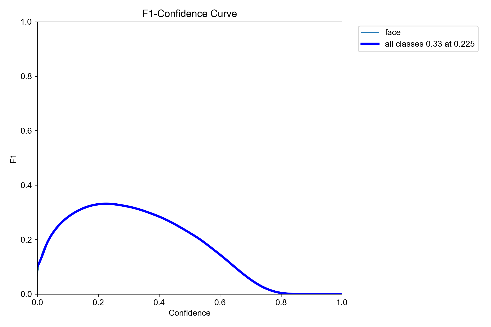
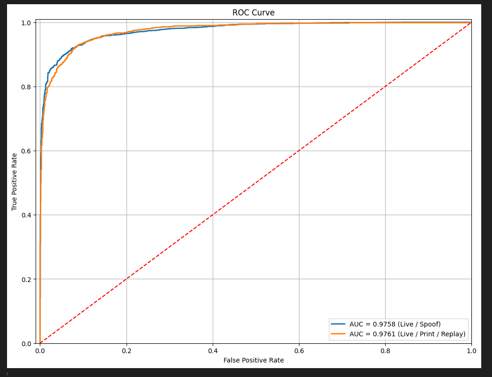
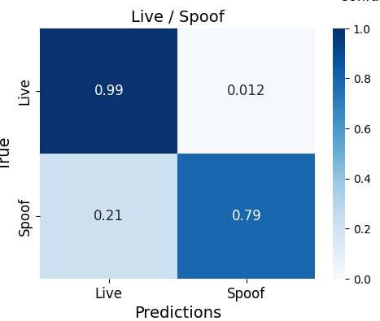
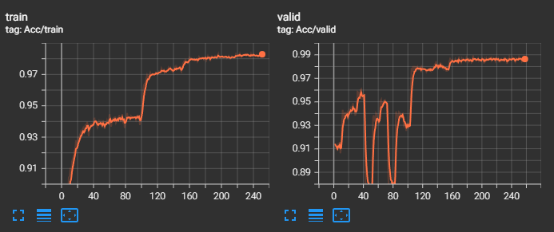
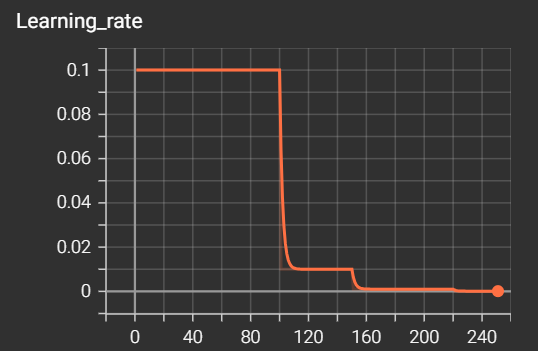
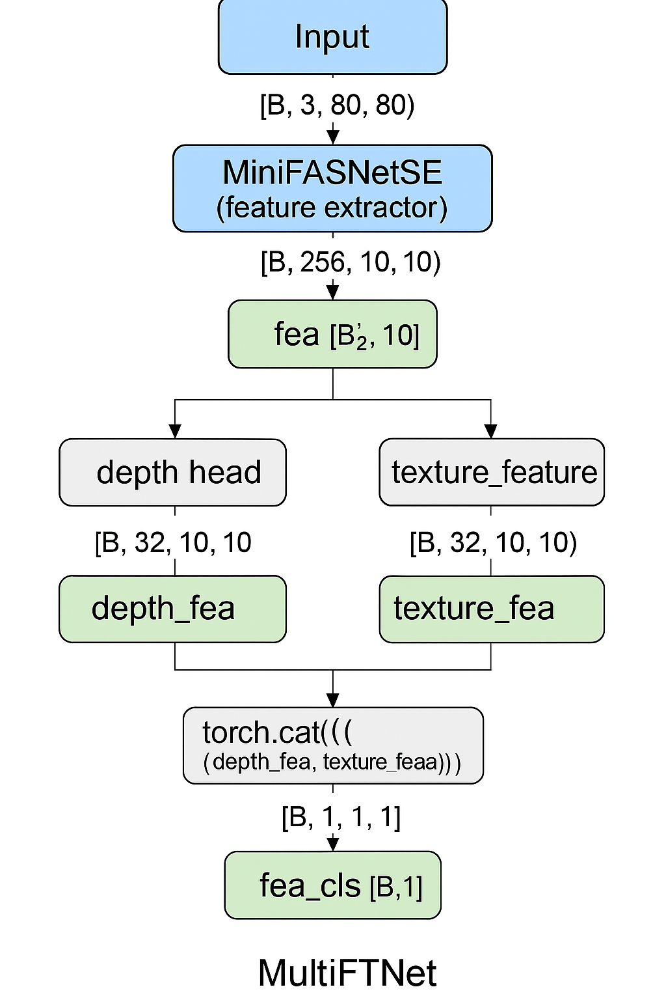
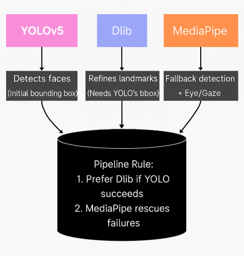

This project is completed for the **SE3508 Introduction to Artificial Intelligence** course at Muğla Sıtkı Koçman University under the supervision of **Dr. Selim Yılmaz**.
## **Overview**


**Seamless-Pass** is a web-based face recognition and liveness detection system built entirely with custom-trained models, excluding any pretrained models for recognition or anti-spoofing. It performs **user registration and authentication** using a webcam with real-time face verification and gesture-based validation, ensuring robust liveness detection. I got the idea from a game named Cyberpunk 2077.

This project leverages a combination of cutting-edge computer vision and deep learning technologies. **YOLOv5** is used for real-time face detection, while **dlib** and **MediaPipe** enable facial landmark tracking and gesture analysis. **OpenCV** supports image processing and camera operations. The system integrates **TensorFlow/PyTorch** for model inference, including anti-spoofing and gesture recognition, and uses **Flask** to provide a lightweight web interface for user interaction and face registration.
## **Structure of The Project**

The files which are below contains used and un-used. I also wanted to share my fail attempts.

```graphql
seamless-pass/
│
├── app.py                            # Main Flask application (routes/UI logic)
├── registration.py                  # Handles registration logic (gesture capture, image save)
├── video_predict.py                 # Handles authentication and anti-spoofing logic
├── converter.py                     # Normalization for YOLOv5
├── face_detector.py                 # Face Detection CNNs
├── data_preparation.py             # Data preprocessing script
├── data_preparation_landmarks.py   # Landmark-specific preprocessing
├── train.py                         # Model training script (custom)
├── train_landmarks.py              # Landmark model training
├── train_landmarks_resnet.py       # ResNet-based training for landmarks(not used, just tried)
├── model_to_onnx.py                # Exports models from .pth to .onnx format
│
├── resnet18_landmark.pth           # Trained ResNet model for landmarks (not used, just tried)
│
├── my_face_landmark_68.dat         # Custom facial landmark detector
├── my_shape_predictor_68.dat       # Custom facial landmark detector 2
│
├── known_faces/                    # Directory to store registered user images
├── model/                          # Custom CNN models
├── saved_models/                   # My models
│
├── src/                            # Contain utility functions for training Anti-Spoofing
├── yolov5/                         # YOLOv5 source directory (custom-trained model, configs)
│
├── static/                         # CSS, JS, images 
├── templates/                      # HTML templates for Flask
│
├── training.xml                    # Annotation file for training (image paths + labels)
├── training_landmarks.csv          # Landmark labels
├── training_landmarks_norm.csv     # Normalized landmark labels
├── testing.xml                     # Test annotation file
├── testing_landmarks.csv           # Test landmark labels
├── testing_landmarks_norm.csv      # Normalized test landmark labels
```


## **Data Preparation**

### YOLOv5 Model Dataset: WIDER FACE Dataset

I got the dataset from http://shuoyang1213.me/WIDERFACE/index.html 
which is an official site of WIDER FACE dataset.

To prepare the WIDER FACE dataset for training a YOLOv5 model, the original annotations—which consist of image paths and face bounding box coordinates—must be converted into the YOLOv5 format. The WIDER FACE annotations include absolute coordinates (x, y, width, height) for each face in an image. These values are parsed and normalized relative to the image dimensions to fit YOLOv5’s requirement: `<class_id> <x_center> <y_center> <width> <height>`, all expressed as values between 0 and 1. For a face detection task, the `class_id` is typically set to 0.

This preparation process involves iterating through the annotation file, computing the normalized coordinates for each bounding box, and generating a corresponding `.txt` file for each image. These label files are stored in a `labels/train/` directory, while the actual face images are copied to `images/train/`. This formatting ensures compatibility with YOLOv5’s training pipeline, enabling the model to effectively learn face detection from custom datasets like WIDER FACE.

One of the challenges encountered during the model conversion process was handling output values exceeding the expected range. Specifically, some values were greater than 1, which is outside the valid range for normalized outputs. To solve this, I applied value clipping to constrain the outputs, capping any values above 1 to ensure consistency and maintain model stability.


### Dlib Model: iBUG dataset

I got the dataset from https://ibug.doc.ic.ac.uk/resources/300-W/
which is an official site of iBUG dataset.

To train the Dlib facial landmark detection model, the iBUG 300-W dataset was used, which provides `.pts` files containing 68 (x, y) landmark coordinates for each face. These `.pts` files were parsed to extract the (x, y) tuples corresponding to the facial keypoints. Each image and its corresponding landmarks were then formatted into an XML structure compatible with Dlib’s training requirements.

The final XML file includes the path to the image, the bounding box around the face, and the full set of 68 landmark points. This structured format allows Dlib to accurately learn the spatial relationships between facial features and train a robust shape predictor model suitable for real-time facial landmark detection.

## Anti-Spoofing Model: CelebA Spoof For Face AntiSpoofing dataset

I got the dataset from [CelebA Spoof For Face AntiSpoofing](https://www.kaggle.com/datasets/attentionlayer241/celeba-spoof-for-face-antispoofing)

For the anti-spoofing model, the CelebA-Spoof dataset was used, which includes images along with bounding box annotations stored in `_BB.txt` files. During data preparation, the images and their corresponding bounding box values were read and compiled into a `.csv` file to streamline the training process.

This preparation step works directly with the exact pixel values of the bounding boxes, without any normalization. Each entry in the CSV contains the image path, the raw bounding box coordinates, and the associated spoof label (e.g., live, print, replay). This format ensures that the model receives precise region-of-interest information for learning to differentiate between real and spoofed faces.

I've got the structure from GitHub: https://github.com/hairymax/Face-AntiSpoofing
## **Model Results**

### Face Detection: YOLOv5 



The training results from the custom YOLOv5 model indicate that while the raw(no pretrained weights used) performance metrics—such as mAP and recall—are relatively modest, they show a consistent upward trend throughout the training process. Specifically, precision, recall, and mAP (both at 0.5 and 0.5:0.95 thresholds) are gradually improving, suggesting that the model is learning useful representations despite the absence of classification loss (as expected for a single-class detector like face detection).

Although the standalone accuracy of the YOLOv5 model may not seem sufficient on its own, it serves as the first stage in a multi-model pipeline. The full system leverages additional components such as Dlib and MediaPipe for detailed landmark localization, eye/gaze detection, and gesture analysis—effectively compensating for YOLO’s limitations. This collaborative pipeline ensures robust performance in real-world face verification and liveness detection, even when the detection model operates with relatively low confidence in isolation.



### Dlib: Face Landmarks

The facial landmark detection model was trained using **Dlib's shape predictor**, which is based on an ensemble of regression trees rather than deep learning. While Dlib itself is not a deep learning library, it provides highly efficient machine learning algorithms optimized for tasks like facial landmark estimation. The training was performed using the **iBUG 300-W dataset**, which provides annotated 68-point landmarks for human faces.

Given that the iBUG dataset alone is relatively small and insufficient for training a high-performance landmark detector, **data augmentation** was applied to increase variation and reduce overfitting. Augmentation included oversampling, which replicates and perturbs existing data to create a larger, more diverse training set. Dlib’s training configuration was fine-tuned with parameters like `oversampling_amount`, `tree_depth`, and `num_trees_per_cascade_level` to balance model complexity and training stability. The resulting model showed an acceptable error level, suitable for downstream tasks like eye closure and gaze direction detection.

train_landmarks.py is given below
```python
import dlib

options = dlib.shape_predictor_training_options()
options.be_verbose = True
options.oversampling_amount = 50       # from 300 to 20 (migth cause overfitting)
options.tree_depth = 5                   # slightly smaller trees
options.cascade_depth = 10                
options.num_trees_per_cascade_level = 250
options.nu = 0.1                    
options.num_threads = 0                 # auto detect all CPU cores

# Training
dlib.train_shape_predictor("training.xml", "my_shape_predictor_68.dat", options=options)
print("training is done")

# Testing
error = dlib.test_shape_predictor("testing.xml", "my_shape_predictor_68.dat")
print(f"the error value is: {error}")

# Error = 1.576525679302643 (it has to be 0 - 0.5 for perfection)
```

### MediaPipe: Iris Detection

It is a pre-trained model… with EAR calculation, I decided to use this pretrained model.

I only use MediaPipe for extracting the iris center, which I then combine with my own EAR-based eye detection but with MediaPipe methods. The rest of the detection is handled by YOLOv5 and Dlib. MediaPipe is used like a helper function.

### Anti-Spoofing(Liveness Detection) Model

To ensure robust liveness detection during authentication, a custom anti-spoofing model was developed using the **CelebA-Spoof dataset**, which contains a wide range of real and spoofed face images, including print, replay, and mask attacks. The dataset provides bounding box annotations in `_BB.txt` files, which were parsed to extract face regions from each image. These pixel-level bounding boxes were used directly—without normalization—to prepare a CSV file that mapped image paths, bounding box coordinates, and spoof labels. This allowed for efficient dataset loading and training while preserving spatial accuracy.

| Task         | Accuracy | AUC-ROC  | Precision | Recall   | F1 score |
| ------------ | -------- | -------- | --------- | -------- | -------- |
| Live / Spoof | 0.8694   | 0.975811 | 0.989852  | 0.788215 | 0.877601 |

The model was trained using a **convolutional neural network** optimized with **Stochastic Gradient Descent (SGD)**. Due to the size and diversity of the dataset, SGD was preferred over optimizers like Adam to avoid memory inefficiencies and improve convergence stability. The classification task involved binary or multi-class labels to distinguish between real faces (`0`) and various spoof types (`1`, `2`, `3` for print attacks, and `7`, `8`, `9` for replay attacks). Throughout training, the model achieved strong performance, with an accuracy of **86.94%**, **AUC-ROC of 0.9758**, and an F1 score of **0.8776**. These metrics indicate that the model is capable of effectively identifying spoofed attempts even in challenging conditions.



Evaluation through ROC curves and confusion matrices further demonstrated the model’s ability to separate live and spoof classes with high confidence. While the anti-spoofing model may not perform perfectly in isolation, it plays a crucial role within the **Seamless-Pass pipeline**, acting as a safeguard against unauthorized logins via photos, videos, or masks. When combined with gesture validation, facial landmark analysis, and real-time detection, the anti-spoofing module significantly enhances the system’s overall security and trustworthiness.

**Confusion Matrix**



Lastly, Those are my accuracy plots:



During the initial training phase of the anti-spoofing model, noticeable fluctuations were observed in the accuracy and validation performance, so I've decided the change the learning rate for better accuracy.

This is my plot for learning rate:




#### Flow Chart of This Model



1) A face image (usually 256x256) is input into the model.
2) The image is cropped into **three different patches** at multiple scales (e.g., center face, eyes, and mouth)
3) Each patch is passed through **its own backbone network** (MiniFASNet, lightweight CNNs) to extract **local features**.
4) The **entire image** is passed through a separate backbones to extract **global features**.
5) All feature maps are **concatenated and fused** to form a unified feature representation.
6) The fused features are passed into a **fully connected layer**.
7) The final prediction: **Live (real)** or **Spoof (fake)**.


## **Combination Of All Models(Full Pipeline)**



- **YOLOv5** = Find faces in the image
- **dlib** = Find detailed facial keypoints on those faces
- **MediaPipe** = Detect precise eye landmarks and iris position for better eye closure and gaze detection

**Full pipeline** handles the task. Even if YOLO misses some detections (low recall), **Dlib and MediaPipe work well on the faces YOLO does find**
